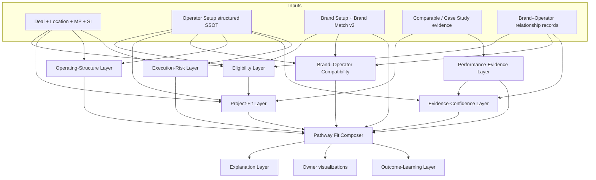

# Operator Fit Engine — Proposed Architecture

**Date:** 2026-08-03  
**Status:** Recommendation only — **not implemented**  
**Inputs:** Current-state audits in `docs/audits/operator-fit-*.md`

---

## 1. Design principles

1. **Do not collapse** Brand–Project, Operator–Project, Brand–Operator Compatibility, Structure, Performance, Confidence, and Risk into one opaque average.  
2. **Eligibility before scoring.**  
3. **Unknown ≠ No ≠ Yes.** Missing data excludes or flags; never awards table-stakes points.  
4. **Table-stakes capabilities are scope/eligibility, not positive differentiation.**  
5. **Preserve owner intake** and live structure option semantics; extend conditionally.  
6. **Explorer is presentation/evidence**, not a second scoring SSOT.  
7. **Deterministic core first**; narrative/AI only explains server outputs.  
8. **Brand Match v2 remains** Brand–Project Fit; do not reinvent it inside OAS.

---

## 2. Layered model



### Eligibility layer

Statuses: `Not Currently Eligible` · `Eligible With Conditions` · `Eligible` · `Preferred Eligibility`

Example gates: Active status; geo presence vs requirement; structure support; brand approval when franchise path needs approved operator; capacity conflicts.

### Project-fit layer

Comparable experience similarity + mandate alignment (opening, turnaround, stabilize, residential, meetings). **No points for generic RM/sales/HR presence.**

### Brand–operator compatibility layer

Credibility of specific brand × operator (approvals, keys operated, tenure, known issues). Separate from Brand–Project and Operator–Project.

### Operating-structure layer

Fit of Third-Party Management / Franchise+Operator / Franchise Only / Owner-Operated / Lease / Asset Management / Brand-managed / To Be Confirmed — using **preserved option vocabularies** with explicit mapping tables.

### Performance-evidence layer

Stores verified or referenced results; marketing claims never enter as verified performance.

### Evidence-confidence layer

Ordinal confidence scales the **trust in the assessment**, not a fake precision multiplier that silently boosts weak operators.

### Execution-risk layer

Transparent penalties/flags: conflicts, thin regional bench, too many simultaneous openings, unresolved diligence.

### Explanation layer

Why / concerns / unknowns / validate / what would change rank — generated from layer outputs (extend OAS narrative packs).

### Outcome-learning layer

Shortlist → contact → response → selection → proposed vs negotiated economics → elimination reasons → owner satisfaction → opening/stabilization vs mandate.

---

## 3. Pathway object (unit of recommendation)

```text
Pathway {
  dealId,
  brandId?,                 // null for independent
  operatorId?,              // null for brand-managed-only / owner-operated
  structure,                // controlled vocabulary
  brandProjectFit,          // Brand Match v2
  operatorProjectFit,       // new deterministic engine
  brandOperatorCompatibility,
  structureFit,
  performanceEvidenceSummary,
  evidenceConfidence,
  executionRisk,
  eligibilityStatus,
  overallPathwayFit,        // composed, explainable — not a mystery average of generics
  explanations[],
  validationItems[]
}
```

Owners compare **pathways**, not isolated operator vanity scores.

---

## 4. Composition policy (recommended)

- Hard fail eligibility → no overall rank (show excluded with reason).  
- OverallPathwayFit = governed composition of layers with **visible weights by mandate**, not one global 90-point OAS clone.  
- Confidence shown beside score; low confidence **cannot** look like high certainty Strong.  
- Risk applies explicit deductions/flags after base fit.  
- Retain current OAS as **legacy Operator–Project v1 signal** during migration; do not delete until pathway UI replaces it.

---

## 5. Data ownership

| Concern | System of record |
| ------- | ---------------- |
| Owner requirements | Existing deal intake Airtable (extend minimally) |
| Operator structured facts | Operator Setup new-base tables |
| Evidence / sources | Partner Intelligence + Case Studies |
| Brand–operator links | Brand Relationships (enriched) |
| Scores | Computed in Node; optional persist on Operator Deal Requests / new Pathway results table |
| Presentation | Explorer fixtures/published fields |

---

## 6. API shape (future)

- `GET /api/deals/:id/operator-fit/pathways` — ranked pathways  
- `GET /api/deals/:id/operator-fit/pathways/:pathwayId` — breakdown by layer  
- `POST /api/deals/:id/operator-fit/shortlist` — persist  
- Retain OAS endpoints during transition for compatibility  

---

## 7. Explicit non-goals (yet)

- LLM-generated numeric scores  
- Replacing owner intake wholesale  
- Scoring CoStar/GTM data in product UI  
- Radar-chart-first UX  
- Treating Explorer JSON as scoring SSOT  
