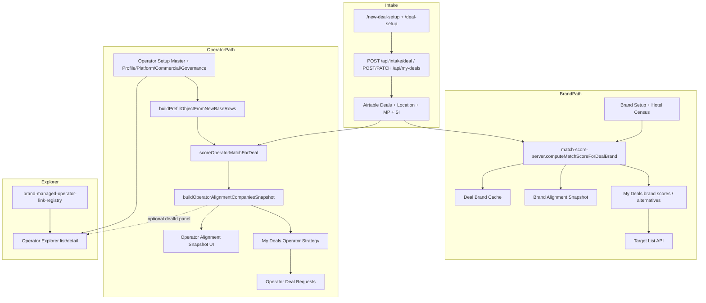

# Operator Fit Engine — Current-State Code Audit

**Date:** 2026-08-03  
**Mode:** Read-only audit (no production behavior changes)  
**Related reports:** `reports/operator-fit-score-simulation.json`, `reports/operator-fit-airtable-readonly.json`  
**Prior OAS work:** `docs/operator-alignment-*.md`, Phase 5A–5F reports under `reports/operator-alignment-scoring-*.json`

---

## 1. Executive verdict (code)

The active operator-matching stack is **real, server-side, and deterministic**, centered on `scoreOperatorMatchForDeal` + Operator Alignment Snapshot (OAS). It is **partially usable but not yet an Operator Fit Engine**: brand matching is stronger and more gated; operator scoring still rewards generic capability presence, under-penalizes risk, and does not separately score brand–operator compatibility, operating-structure pathways, performance evidence, or execution risk.

**Change impact classification:** Audit only — **Low** (docs + read-only scripts). No production mappings or scoring formulas changed.

---

## 2. Code inventory

| Area | File or Module | Purpose | Inputs | Outputs | Airtable Dependency | Scoring Role | UI Role | Current Status | Concerns |
| ---- | -------------- | ------- | ------ | ------- | ------------------- | ------------ | ------- | -------------- | -------- |
| Operator score engine | `api/my-deals.js` → `scoreOperatorMatchForDeal` | Weighted OAS company score | Deal + Location + MP + SI + operator prefill | `{ score, breakdownDetails }` | Deals + child tables; Operator Setup via prefill | **Primary** | Breakdown modal | **Active** | Fee placeholder 75; owner-relations keyword 70/90; negative “penalty” is weight-2 factor |
| Operator factor helpers | `lib/operator-alignment-scoring-factors.js` | Geo, structure, services, asset/stage, reporting | Normalized deal + op arrays | Factor score + rationale + missingDataClass | Indirect | Active | Feeds breakdown | Active (Phase 5E) | Overlap helpers give partial credit when intersection empty |
| Operator weights | `lib/operator-alignment-scoring-weight-config.js` | SSOT weights/bands | — | `OPERATOR_MATCH_WEIGHTS` (sum 90) | None | Active | Generated JS for bands | Active | Fixed weights for every project type |
| Deal normalizer | `lib/operator-alignment-deal-normalize.js` | Structured SI first, legacy fallback | Deal/SI/MP/Location fields | Normalized deal object | Field name maps | Active | Hidden | Active | Legacy MP `Preferred Deal Structure` still fallback |
| Company alignment | `lib/operator-alignment-company-utils.js` | Rank Active operators; completeness gate | Deal context + Active Master candidates | Companies snapshot + bands | Operator Setup Master + linked rows | Active | OAS companies / My Deals Operator Strategy | Active | Numeric score only when completeness “sufficient” + ≥3 factors |
| Profile OAS | `lib/operator-alignment-profile-utils.js` | Archetype / pathway signals (no named ranking) | Deal SI signals | Profile snapshot | Deal SI | Heuristic (not weighted company score) | OAS profile mode | Active | Intentionally not company ranking |
| OAS API | `api/operator-alignment-snapshot.js` | Profile + companies endpoints | `dealId` | Snapshot JSON | Via utils | Serves scores | Standalone + My Deals modal | Active | Product copy avoids “recommended operators” |
| Operator Setup read | `api/lib/operator-setup-new-base-read.js` | Prefill + Explorer list/detail | Master ID | Prefill object / list rows | New-base Operator Setup tables | Data source | Explorer + scoring | Active | Writer still legacy-primary (`OPERATOR_SETUP_USE_NEW_BASE_WRITER=0`) |
| Brand Match v2 | `api/match-score-server.js` + `lib/brand-match-scoring-weight-config.js` | Brand–project fit | Deal + Brand Setup + Census | Score, gates, alternatives | Brand Setup, Hotel Census, Deal Brand Cache | Active brand engine | My Deals brand scores | Active | Separate from operator fit; stronger hard gates |
| Legacy brand fit | `api/brand-fit-analyzer.js` | Old 5-dimension analyzer | Deal + brands | Fit scores | Mixed | Legacy | Older paths | Legacy / parallel | Hard-coded baselines (50) and defaults |
| Brand Explorer fit | `api/brand-explorer.js` `computeFitScores` | Presentation fit-to-deal | Deal + brand profile | 5 dims | Brand Explorer fixtures/Airtable | Presentation only | Brand Explorer | Parallel | Fixed economics 75 / deal structure 70 |
| Brand Alignment Snapshot | `api/brand-alignment-snapshot.js` + public JS/HTML | Owner brand review narrative | Deal + scores | Snapshot document | Deal Brand Cache / preferred / target list | Narrative over Brand Match | `/brand-alignment-snapshot` | Active | Pattern OAS mirrors |
| Target list | `api/target-list.js` | Brand shortlist CRUD | Deal + brand | Target List rows | Target List table | Stores brand scores | My Deals Target List | Active | **Brand** shortlist only — no operator shortlist table |
| Operator Deal Requests | `api/operator-deal-requests.js` | Outreach workflow | Deal + operator | Request rows w/ alignmentScore | Operator Deal Requests | Persists score at contact | My Deals Operator Strategy | Active | Closest thing to operator shortlist |
| Operator Capability Snapshot | `lib/operator-capability-snapshot-build.js` | Deal-only capability readiness | Deal P0 fields | OCS payload | Deal SI/Deals | Not company ranking | OCS page/modal | Active | Inputs for later operator fit; not a match engine |
| Operator Explorer UI | `public/js/operator-explorer*.js`, `operator-explorer-new-base-profile.js` | Discovery + gold profiles | Active operators API | Cards/tabs | Operator Setup + fixtures | Optional deal alignment panel | `/operator-explorer*` | Active | Discovery, not ranked fit |
| Operator Strategy UI | `public/js/operator-strategy-my-deals.js` | Cross-deal company table + score modal | Companies API + breakdown | Table + bars | Via APIs | Displays OAS | My Deals tab | Active | “Add to Operator Review” coming soon |
| Score UI helper | `public/js/operator-match-score-ui.js` + generated config | Band labels/classes | Weights config | CSS class helpers | None | Presentation | My Deals | Active | Safe |
| OAS field inject | `public/js/oas-inject-form-fields.js` | Inject OAS deal fields into intake | — | Form fields | Maps to SI/Deals | Intake support | `/new-deal-setup` | Active | Preserve mappings |
| Deal intake | `public/new-deal-setup.html`, `deal-setup.html`, `api/intake-deal.js`, `api/my-deals.js` | Create/edit projects | Owner form | Deal + child records | Deals + Location + MP + SI | Provides scoring inputs | `/new-deal-setup`, `/deal-setup` | Active | Canonical intake — do not replace |
| Deal compare | `public/deal-compare.html`, `api/deal-compare.js` | Brand proposal comparison | Proposals | Comparison table | Brand Deal Requests / library | No match scores | `/deal-compare` | Active | Brand proposals only |
| Brand-managed registry | `public/js/brand-managed-operator-link-registry.js` | Links brand-managed cores | Hardcoded rec map | Explorer links | Soft | Presentation | Explorer | Active | Not scored as pathway |
| GTM target lists | `api/target-list.js` vs `lib/gtm-owner-target/*` | GTM/pilot lists | GTM base | Outreach lists | GTM base | Unrelated to product OAS | Internal | Separate product | Do not conflate with deal Target List |
| Audit scripts (this phase) | `scripts/audit-operator-fit-airtable-readonly.mjs`, `scripts/audit-operator-fit-score-simulation.mjs` | Read-only inspection + synthetic scoring | Env / fixtures | JSON reports | Read-only / none | Diagnostic | None | New audit utilities | Not production routes |

---

## 3. Entry points (exact)

| # | Workflow | Entry point |
| - | -------- | ----------- |
| 1 | Create/edit owner project | `POST /api/intake/deal` (`api/intake-deal.js`); `POST/PATCH /api/my-deals` (`api/my-deals.js`); UI `/new-deal-setup`, `/deal-setup` |
| 2 | Load project requirements | `GET /api/my-deals/:recordId`; `fetchDealScoringContext` in `api/my-deals.js` |
| 3 | Load operator data | `loadActiveOperatorCandidatesForAlignment` (`lib/operator-alignment-company-utils.js`); `loadNewBaseOperatorBundle` / `buildPrefillObjectFromNewBaseRows` |
| 4 | Calculate operator match | `scoreOperatorMatchForDeal` → used by `buildCompanyAlignmentResult`; breakdown via `GET /api/my-deals/:id/operator-match-score-breakdown` |
| 5 | Calculate brand match | `computeMatchScoreForDealBrand` (`api/match-score-server.js`); `GET .../match-score-breakdown` |
| 6 | Build operator recommendations | **No “recommendations” product surface** — `buildOperatorAlignmentCompaniesSnapshot` returns “companies for consideration” sorted by score/band |
| 7 | Display operator results | `/operator-alignment-snapshot.html`; My Deals Operator Strategy + OAS modal; deal-aware Explorer panel |
| 8 | Save shortlist / target list | Brand: `api/target-list.js`. Operator: create Operator Deal Request (no dedicated operator Target List) |
| 9 | Operator Explorer profiles | `/operator-explorer` → `/operator-explorer-gold-mock.html?id=rec…` |
| 10 | AI rationales | Brand/Operator Alignment Snapshot narrative framed as AI-assisted presentation; **numeric engines are deterministic JS** (no LLM in `scoreOperatorMatchForDeal` / Brand Match v2) |

---

## 4. Logic classification

| Engine | Location | Deterministic? | Client vs server | AI? | Airtable-driven inputs? |
| ------ | -------- | -------------- | ---------------- | --- | ----------------------- |
| OAS company score | `scoreOperatorMatchForDeal` | Yes | Server | No | Yes |
| OAS profile signals | `operator-alignment-profile-utils` | Heuristic rules | Server | No | Yes |
| Brand Match v2 | `match-score-server` | Yes (+ hard gates) | Server | No | Yes |
| Brand Explorer fit | `brand-explorer.js` | Yes (presentation constants) | Server | No | Mixed |
| Legacy brand-fit-analyzer | `brand-fit-analyzer.js` | Yes (hard-coded) | Server | No | Mixed |
| Snapshot narratives | BAS/OAS renderers | Template + factor rationales | Server + client render | Presentation “AI-assisted” label; not score input | Yes |

---

## 5. Tests (matching / alignment)

| Test / validator | Role | Result on 2026-08-03 |
| ---------------- | ---- | -------------------- |
| `scripts/validate-operator-alignment-phase-5e.mjs` | Wiring + franchise/management separation | **Passed** |
| `scripts/validate-operator-alignment-companies.mjs` | Companies snapshot contracts / copy | **Passed** |
| `scripts/test-operator-alignment-snapshot-page.mjs` | Page/renderer contracts | **2 FAIL** (My Deals action wiring / compact preview string checks — pre-existing UI contract drift; not introduced by this audit) |
| Pure unit suite for every OAS factor × weight | — | **None found** |
| Synthetic differentiation sim | `scripts/audit-operator-fit-score-simulation.mjs` | Ran; see scoring audit |

There is **no exhaustive pure unit-test suite** asserting every Brand Match v2 or OAS factor combination.

---

## 6. Current code flow

---

## 7. Duplication / legacy risks

1. **Three brand-fit systems** coexist (Brand Match v2, legacy analyzer, Brand Explorer fit).
2. **OAS profile vs company modes** are intentional but easy to confuse with “recommendations.”
3. **Target List** (brands) ≠ GTM target lists ≠ Operator Deal Requests.
4. **Generic capability scoring** remains in OAS (`feeCommercial` flat 75; `ownerRelations` keyword; `systemsReporting` presence-heavy; services overlap rewards table-stakes lists).
5. **Missing-data exclusion** can inflate scores when few factors remain (confirmed in synthetic sim: sparse operator scored 94.9 on lifestyle scenario).

---

## 8. Safety to extend

| Module | Safe to extend? | Notes |
| ------ | --------------- | ----- |
| Weight config modules | Yes, with tests | Already SSOT |
| Factor helpers | Yes, carefully | Do not silently change missing-data semantics |
| `scoreOperatorMatchForDeal` | Extendable but needs refactor for multi-layer fit | Today collapses everything into one average |
| OAS / BAS UI patterns | Strong reuse | Score bars, snapshot book, print |
| Legacy brand-fit-analyzer | Prefer deprecate path | Do not build Operator Fit on it |
| Operator Explorer fixtures | Content pipeline | Do not duplicate into scoring SSOT |

---

## Data Contract Snapshot (modules touched by audit only)

- **Airtable tables:** Operator Setup -*; Deals; Location & Property; MP; SI; Operator Deal Requests; Deal Brand Cache; Brand Setup -*; Target List  
- **Mapping objects:** `OPERATOR_MATCH_WEIGHTS`, `OPERATOR_MATCH_FACTOR_DEFINITIONS`, `OAS_DEAL_*_FIELD_NAMES`, `BRAND_MATCH_NEW_WEIGHTS`, new-base read prefill keys  
- **Required for scored company view:** Active Master + profile/platform links + markets + chain scales + services/structures (completeness gate)  
- **UI output shapes:** OAS profile snapshot; companies-for-consideration rows; brand match breakdown; Target List brand rows  

## Regression checklist (audit phase)

- What could break: nothing in production (read-only scripts + docs only).  
- Retest after any future scoring change: Phase 5E validator, companies validator, OAS page test, synthetic sim, live `audit-operator-alignment-scoring.mjs`.  
- Airtable fields touched: **none** (read-only).
