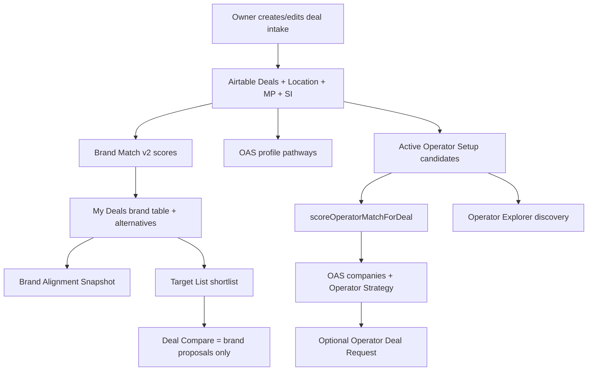

# Operator Fit Engine — Current User Flow

**Date:** 2026-08-03  
**Surfaces:** `/new-deal-setup`, `/deal-setup`, `/my-deals`, Brand/Operator Alignment Snapshots, Explorers, Target List, Deal Compare

---

## Flow map (current)

---

## Flow A — Project setup → brand recommendations

| Step | Page / route | User action | Data collected | Airtable fields | Code | Logic | Output | Saved? | Missing / confusion | Differentiates operators? |
| ---- | ------------ | ----------- | -------------- | --------------- | ---- | ----- | ------ | ------ | ------------------- | ------------------------- |
| A1 | `/new-deal-setup` or `/deal-setup` | Enter project | Property, geo, scale, rooms, capital, strategic intent, brands, operator pathway fields | Deals, Location, MP, SI (see deals fields doc) | `api/my-deals`, `api/intake-deal`, `oas-inject-form-fields.js` | Validation / PATCH | Deal record | Yes | Dual intake pages; legacy vs structured SI | Indirect (feeds later OAS) |
| A2 | `/my-deals` | View brands | — | Deal Brand Cache, preferred brands | `match-score-server.js` | **Deterministic** Brand Match v2 weighted soft factors + preferred bonus + **hard gates** | Score /100, breakdown bars | Cache refresh | Insufficient data if &lt;40% soft weight | N/A (brands) |
| A3 | Alternatives | Review alternatives | — | Brand Setup + Census density | `computeTopAlternativeBrands` | Ranked candidates (bounded) | Alternative brands | Optional add | Owner preferred vs system recommended treated via preferred bonus / exclusion rules | N/A |
| A4 | `/brand-alignment-snapshot` | Read narrative | Scores + deal context | Same | `brand-alignment-snapshot.js` | Narrative over scores | Pathways, rationales, validation items | No (view) | Confidence/gaps shown as copy | N/A |

**Answers:**

- **Influencing attributes:** geography priority, same-brand density, chain scale, standards, fees, rooms, service model, key money, soft/hard, incentives, agreements, building type; preferred-brand bonus; gates on key money / agreement / project type / market-to-avoid.  
- **Deterministic vs AI:** numeric = deterministic; snapshot may be labeled AI-assisted presentation.  
- **Weights:** fixed in `lib/brand-match-scoring-weight-config.js`.  
- **Eligibility gates:** yes (hard gates → 0).  
- **Confidence / missing data:** insufficient-data path when soft weight coverage &lt;40%; null factors excluded.  
- **Owner-selected brands:** preferred bonus (+4 cap 100); alternatives exclude preferred.

---

## Flow B — Project setup → operator “recommendations”

| Step | Page / route | User action | Data | Fields | Code | Logic | Output | Saved? | Gaps | Differentiation? |
| ---- | ------------ | ----------- | ---- | ------ | ---- | ----- | ------ | ------ | ---- | ---------------- |
| B1 | Intake | Set operating model / management structure / services / reporting | SI + Deals P0 | Preferred Management Structure, Operating Model, Brand Agreement Structure, Must-Have Operator Services, Market Presence Requirement, etc. | normalizer | Structured-first | Normalized deal | Yes | Owners may still fill legacy MP Franchise Only | **High leverage if structured** |
| B2 | Operator Strategy / OAS | Open snapshot | Active operators | Operator Setup linked rows | `buildOperatorAlignmentCompaniesSnapshot` | Completeness gate → score | Bands + optional /100 | No until outreach | Product avoids “recommended” wording | Limited — see scoring audit |
| B3 | Score breakdown | Click score | One operator | Prefill fields | `getOperatorMatchScoreBreakdown` | Same engine | Weighted bars | No | Fee/owner factors weak | Explains components but components often flat |
| B4 | Contact | Create request | Operator + deal | Operator Deal Requests Alignment Score/Band | `operator-deal-requests.js` | Persist snapshot | Pipeline row | Yes | Not a shortlist compare store | Weak |

**Answers:**

- Operators enter after deal context exists; filtered to **Active** Operator Setup (not brand-approved subset).  
- Brand experience via preferred-brands ∩ operator brands only (weight 6); **no brand-approval compatibility layer**.  
- Brand-managed vs third-party: represented in SI + operator structures + brand-managed registry for Explorer — **not a pathway score object**.  
- Scores: absolute 0–100 weighted average of non-null factors; bands Strong/Moderate/…  
- Generic capabilities: **yes, dominate** when Offered Services / systems / owner-relations presence scores high.  
- Risks: negative-fit weight 2 only; missing often **excluded** (can inflate).  
- Unknown vs no: improved in 5E (`needs_validation` / null exclude) but sparse-data inflation remains.  
- Evidence quality: Data Confidence display only — **does not scale score**.

---

## Flow C — Operator Explorer

| Aspect | Current state |
| ------ | ------------- |
| Owner sees | Discovery cards (name, type, badges, summary, chain-scale rail); gold profile tabs (geography, brands, services, openings, reporting, materials, leadership, case studies) |
| Airtable-only | Many structured commercial/governance fields not surface-complete; PI source library depth |
| Code-only | Brand-managed link registry; fixtures/gold mock fallbacks; factory preview flags |
| Dynamic | Deal-aware Alignment Context panel when `dealId` present |
| Differentiated profiles? | **Content/Explorer quality** can differentiate (Arbor/HE baselines); **numeric OAS** often does not |
| Strengths / limitations visible? | Narratives and bf_not_ideal; not systematic risk scoring |
| Comparables visible? | Case study children when populated |
| Can support Fit Engine without duplicating? | **Yes as evidence/presentation layer** if scoring reads structured SSOT + case studies — do not rescore from Explorer JSON |

---

## Flow D — Shortlisting and comparison

| Capability | Exists? | Notes |
| ---------- | ------- | ----- |
| Brand shortlist | Yes | Target List statuses Considering → Won |
| Operator shortlist | **No dedicated** | Operator Deal Requests + Strategy checkboxes; “Add to Operator Review” coming soon |
| Side-by-side operators | **No project-specific compare UI** | Strategy table is list/sort, not matrix |
| Brand proposal compare | Yes | `/deal-compare` — fees/terms, not match scores |
| Brand library compare | Yes | Reference, not deal-specific |
| Brand×operator pathway compare | **No** | |
| Why scores differ | Partial | Breakdown bars per operator; not comparative delta view |
| Validation follow-ups | Partial | OAS questions / needs validation |
| Decision record | Partial | Requests + target list; no outcome learning |

---

## Contribution to operator differentiation (by step)

| Step | Meaningful differentiation? |
| ---- | --------------------------- |
| Structured SI management/operating/services | Yes — when filled |
| Brand Match v2 | Differentiates **brands**, not operators |
| OAS numeric score (current weights + sparse op data) | **Weak** |
| OAS narrative templates | Improved in 5F but still factor-templated |
| Explorer profiles | Qualitative differentiation if content rich |
| Target List / Deal Compare | Brand pathway only |
