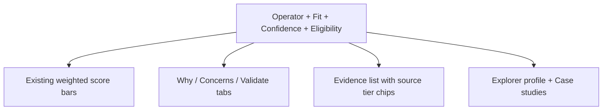

# Operator Fit Engine — Visualization Options

**Date:** 2026-08-03  
**Constraint:** Assess feasibility against current stack; do **not** build production UI yet.  
**Design system to reuse:** My Deals + Brand/Operator Alignment Snapshot (BAS/OAS book), `match-score-breakdown-ui.js` bars, deal-compare sticky tables, Explorer chips/badges, print-to-PDF.

---

## 1. Current frontend stack (audit)

| Layer | Finding | Evidence |
| ----- | ------- | -------- |
| Framework | Static HTML + vanilla JS (not React SPA) | `public/*.html`, `public/js/*` |
| Routing | Express static aliases in `server.js` | `/my-deals`, `/operator-alignment-snapshot`, explorers |
| Component library | No Material/Chakra; bespoke CSS | `public/css/brand-alignment-snapshot.css`, OAS CSS, deal-workspace |
| Charts | Chart.js loaded on deal-setup; **decision UIs use bars/cards/tables** | deal-setup scripts; breakdown UI |
| Score bars | Weighted horizontal bars | `public/js/match-score-breakdown-ui.js` |
| Progress / KPI cards | Pipeline metric strips | `deal-workspace-insights.js` |
| Comparison tables | Sticky first column, collapsible sections, “best” cells | `deal-compare.html`, `brand-library-compare.html` |
| Tabs / accordions | My Deals tabs; Explorer profile tabs | `my-deals.html`, operator explorer gold |
| Modal / drawer | OAS modal in My Deals; breakdown modals | `my-deals.html` |
| Colors / type | Dealality BAS/OAS print + product CSS variables | Snapshot CSS |
| PDF | Browser print / Save as PDF (iframe export pages) | `*-export.html`, snapshot print |
| Owner report layouts | BAS/OAS 3-page book; deal brief | alignment snapshots, deal-brief |

---

## 2. Concept evaluations

### Visualization 1 — Operator recommendation cards

**Desired:** name, adjusted fit, confidence, eligibility, rank, brands, 3 reasons, 2 concerns, validation, completeness.

| Feasibility | Detail |
| ----------- | ------ |
| Existing components | OAS company cards + Strategy table rows + band badges + confidence + whatSupports / whatNeedsValidation |
| Can build now? | **Partial** — cards exist as “companies for consideration,” not “recommendations” |
| Missing data | Eligibility status enum; evidence confidence driving rank; true concerns from risk layer; pathway brand link |
| Classification | **Can build with current data** as ranked alignment cards (honest copy); **Requires meaningful enrichment** for performance reasons / confidence meter |

### Visualization 2 — Fit-dimension breakdown

Dimensions desired exceed today’s 10 OAS factors. Map now:

| Future dimension | Current proxy |
| ---------------- | ------------- |
| Comparable experience | assetProjectStageFit + case studies (not scored) |
| Relevant performance | **Missing** |
| Commercial fit | serviceOfferings (generic-heavy) |
| Ownership/governance | systemsReporting + ownerRelations (weak) |
| Brand/market execution | geography + brandPortfolio |
| Economics | feeCommercial placeholder |
| Capacity / execution risk | **Missing** (negativeFit tiny) |

**Formats:** Prefer **horizontal bars** (already ship) and compact matrix. **Radar chart:** possible via Chart.js but poor for owners with missing axes and false-precision risk — **not recommended** as primary.

| Classification | Horizontal bars: **Can build with current data**. Multi-layer dimensions: **Requires meaningful data enrichment**. |

### Visualization 3 — Side-by-side operator comparison

| Topic | Assessment |
| ----- | ---------- |
| Max operators | **3 desktop** sticky; **2 mobile** stacked; optional 4th = overload (deal-compare precedent) |
| Sticky headers | Reuse deal-compare pattern |
| Highlight diffs | Yes — extend “best cell” pattern; mark **Unknown** distinctly from **Negative** |
| Export | Print stylesheet feasible (BAS/OAS print) |
| Project-specific? | Must pass `dealId` — Strategy table today is not a matrix |
| Classification | **Can build with minor schema changes** for shortlist persistence; enrichment for performance rows |

### Visualization 4 — Brand-and-operator pathways

Needed scores: Brand–Project (exists), Operator–Project (weak OAS), Brand–Operator Compatibility (**missing**), Structure Fit (partial factor), Overall Pathway (**missing object**).

Formats: ranked pathway cards or brand columns with operator options beat decision trees for v1.

| Classification | **Requires meaningful data enrichment** (+ compatibility records). Shell UI could mock with Brand Match + OAS only if labeled incomplete. |

### Visualization 5 — Why this operator

OAS already has supports / validate / weaken / questions. Expand with comparable hotels + source tiers.

| Classification | **Can build with current data** (copy structure); evidence tiers **need enrichment**. |

### Visualization 6 — Evidence confidence

Visual language: ordinal chips (Verified project · Referenced · Operator-reported · Portfolio-level · Marketing claim · Unknown) — **not** a fake 0–100 precision gauge as the hero metric.

| Classification | **Can build with minor schema changes** if Master Data Confidence + per-field source status populated; else explanation-only. |

### Visualization 7 — Score sensitivity

Real-time recalc is **feasible** server-side (same Node functions) or client if config endpoints reused. Risks: owners gaming weights; confusion vs Dealality-governed model. Preserve “Dealality baseline” vs “Owner scenario” side by side.

| Classification | **After** deterministic multi-layer MVP; governed weights locked; owner adjusts only a small priority set. |

---

## 3. Low-fidelity wireframes

### A. Top-five operator results

```text
┌ My Deals / Operator Fit ─────────────────────────────────────────┐
│ Deal: [Name]   Brand focus: [Preferred / All eligible]           │
│                                                                  │
│ ┌ Rank 1 ─────────────────────────────────────────────────────┐  │
│ │ Operator Name          Fit 82  · Confidence: Referenced       │  │
│ │ Eligible · Franchise + Operator · Brands: A, B                │  │
│ │ Why: geo match · structure match · reporting level            │  │
│ │ Watch: no verified comps · fee unknown                        │  │
│ │ [Breakdown] [Compare] [Shortlist] [Explorer]                  │  │
│ └───────────────────────────────────────────────────────────────┘  │
│ … ranks 2–5 …                                                    │
│ Footnote: Scores are alignment signals, not endorsements.        │
└──────────────────────────────────────────────────────────────────┘
```

| | |
| -- | -- |
| Data required | Ranked OAS + confidence + eligibility |
| Available now | Score/band/signals/gaps |
| Missing | Eligibility enum, confidence tiers, pathway |
| Reuse | OAS cards, Strategy table, badges |
| New | Rank header, shortlist actions |
| Complexity | Medium |
| Airtable | Optional shortlist table |
| Build now? | Yes as **Alignment Top 5** with honest labels |
| Wait? | Performance “why” bullets |

**Feasibility:** Can build with current data (labeled).

### B. Operator result detail



**Feasibility:** Can build with current data + minor enrichment for tiers.

### C. Side-by-side comparison

```text
                 Op A     Op B     Op C
Overall fit       82       77       71
Confidence      Ref.     Unk.     Op-rep
Eligibility      Yes      Cond.    Yes
Geo               ●●●      ●●○      ●○○
Structure         ●●●      ●●●      ●○○
Services*         ●●○      ●●○      ●●●   (*non-generic only)
Governance        ●●●      ●○○      ●●○
Unknowns          Fees     Comps    Brand approval
```

**Feasibility:** Can build with minor schema changes (shortlist); meaningful enrichment for comps/performance.

### D. Brand-and-operator pathway comparison

```text
Brand A (Brand–Project 88)
  ├─ Brand-managed pathway     Overall —  · Compat n/a · Structure fit
  ├─ + Operator 1 (Op fit 82)  Overall ?? · Compat ?? 
  └─ + Operator 2 (Op fit 74)  …

Brand B (Brand–Project 79)
  └─ + Operator 3 …
```

**Feasibility:** Requires meaningful enrichment (compatibility + pathway object).

### E. Evidence and validation panel

```text
Verified project evidence   [list or empty state]
Referenced sources          [URLs + dates]
Operator-reported claims    [clearly labeled]
Unknowns / ask in outreach  [checklist]
What could change ranking   [bullets]
```

**Feasibility:** Can build shell now; requires enrichment for verified comps.

---

## 4. Recommended first visualization

**Ranked Operator Alignment cards (Top 5) + existing factor breakdown bars**, using BAS/OAS visual language and explicit non-endorsement footnote.

**Why first:** Reuses shipped components; works with current APIs; forces product honesty about confidence/gaps; does not wait on pathway graph or performance warehouse.

**Do not lead with** radar charts, sensitivity sliders, or pathway matrices.

---

## Data Contract Snapshot (visualization)

- APIs: `/api/operator-alignment-snapshot/:dealId/companies`, operator-match-score-breakdown, Explorer detail, Brand Match breakdown for pathway later  
- UI output: card list, bar breakdown, optional compare table, print PDF  
- Required fields: those already on companies snapshot; confidence/eligibility enhancements later
