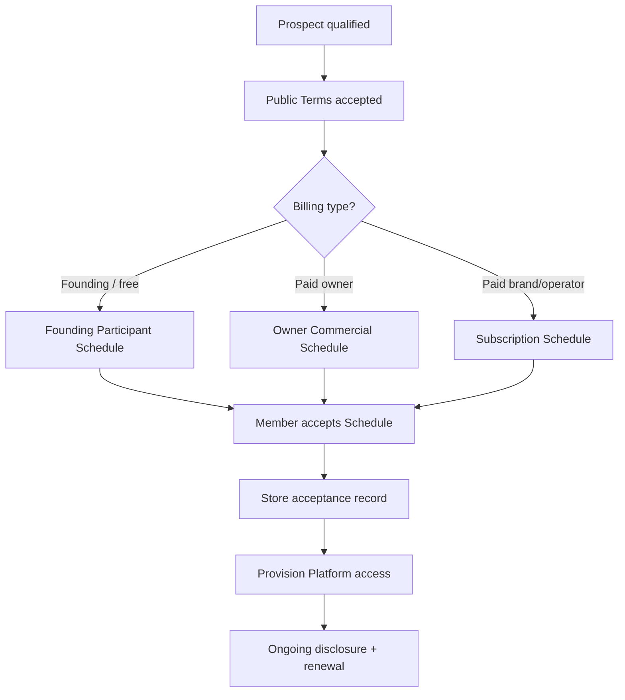

# Dealality Commercial Onboarding Process

**Purpose:** Define how members move from public Terms acceptance → private commercial schedule → paid or complimentary participation.

**Authority:** Public [Terms of Service](/terms.html) + confidential Commercial Terms Schedule per member.

**Contact:** hello@aohospitalityadvisors.com

---

## Overview

| Layer | Document | Public? | Controls |
|-------|----------|---------|----------|
| 1 | Terms of Service | Yes | Legal framework, conduct, disclaimers, disclosure rules |
| 2 | Commercial Terms Schedule | No | Dollars, tiers, waivers, term length |
| 3 | Acceptance record | Internal | Proof of who accepted what and when |

---

## Step-by-step process

### Step 1 — Qualify the member

Before sending commercial paperwork, confirm:

- [ ] Member type: Owner / Brand / Operator
- [ ] Member Representative has authority to contract
- [ ] Fit for Platform access (not paid placement)
- [ ] Billing path: **Founding (free)** vs **Standard (paid)**

### Step 2 — Public Terms acceptance (required for everyone)

Every user must accept the public Terms before or during onboarding.

**Minimum viable (now):**

1. User checks a box linking to `/terms.html` during signup or onboarding email
2. Store: user email, timestamp, Terms version/date ("Updated July 16, 2026")

**Better (later):**

- In-product Terms acceptance modal with version tracking
- Memberstack / auth-linked acceptance log

> Founding users still accept the **same public Terms**. Complimentary pricing is handled in Step 3, not by skipping Terms.

### Step 3 — Issue the correct private Schedule

| Scenario | Template to use |
|----------|-----------------|
| Early user, no charge | `docs/templates/commercial-terms-schedule-founding-participant.md` or PDF-ready HTML |
| Paying owner | `docs/templates/commercial-terms-schedule-template.md` (Section 3 + Discount Summary) |
| Paying brand | `docs/templates/commercial-terms-schedule-template.md` (Section 4 + Discount Summary) |
| Paying operator | `docs/templates/commercial-terms-schedule-template.md` (Section 5 + Discount Summary) |
| Discounted paid member | Same standard template — complete **list fee**, **discount type/amount**, and **net fee** |

### Discounts (partial or full)

You can discount without rewriting the Terms. Record discounts on the private Schedule and in Airtable:

| Record | What to capture |
|--------|-----------------|
| List / standard fee | Pre-discount price (e.g. $36,000 / year or $75 / key) |
| Discount type | Percent, fixed USD, or full waiver |
| Discount amount | e.g. `25%` or `$9,000` |
| Net fee | Amount actually billed (e.g. $27,000 / year) |
| Duration | First year only, full term, or through a date |
| Reason / code | Optional label for tracking |

**Billing rule:** Invoice the **net fee**. Keep list fee on file so renewals can return to standard pricing when the discount expires.

Examples:

- Brand Growth list $36,000 → **25% discount** → net **$27,000** first year
- Owner success fee list $100/key → **$20/key discount** → net **$80/key**
- Founding participant → **100% waiver** → net **$0**

Airtable fields: see `docs/commercial-acceptance-airtable-fields.md` (`Discount Applied`, `Discount Percent`, `Discount Amount USD`, list vs net fee fields).

**How to send (Phase 1 — manual):**

1. Copy template → fill in member-specific fields
2. Export to PDF or send as secure doc
3. Email from hello@aohospitalityadvisors.com with subject: `Dealality — Commercial Terms Schedule for [Company Name]`
4. Ask Member Representative to reply **"I agree"** with name/title, or sign via DocuSign

**How to send (Phase 2 — in platform):**

- Private onboarding link (not in public nav)
- Click-to-accept with Schedule ID + timestamp stored in Airtable

### Step 4 — Capture acceptance (required)

Store an acceptance record for every member:

| Field | Example |
|-------|---------|
| `schedule_id` | CTS-FOUND-001 |
| `member_legal_name` | Example Hotel Group LLC |
| `member_type` | Owner Member |
| `billing_class` | founding_complimentary |
| `terms_version` | 2026-07-16 |
| `schedule_version` | v1.0 |
| `accepted_by_name` | Jane Smith |
| `accepted_by_email` | jane@example.com |
| `accepted_at_utc` | 2026-07-16T14:30:00Z |
| `acceptance_method` | email_reply / docusign / click_accept |
| `effective_date` | 2026-07-16 |
| `founding_end_date` | 2027-07-16 (if applicable) |
| `file_link` | Google Drive / Airtable attachment |

**Rule:** Do not enable full production access for fee-bearing workflows until Steps 2 **and** 4 are complete.

### Step 5 — Provision access

After Terms + Schedule acceptance:

- [ ] Create / activate Member Account
- [ ] Assign role: Owner / Brand / Operator
- [ ] Apply access scope (regions, brands, workflows) per Schedule
- [ ] Tag account in CRM/Airtable: `founding_participant` or `standard_paid`

### Step 6 — Operate and monitor

Ongoing obligations (including founding users):

- Milestone disclosure within 5 days (LOI, definitive agreement)
- Respond to Dealality status requests
- Keep Member Representative current

For **paid** members: invoice per Schedule.

For **founding** members: no invoices, but still track milestones for future transition conversations.

### Step 7 — Renewal or transition

| Member class | At term end |
|--------------|-------------|
| Founding Participant | Send **30+ days notice** + new Standard Schedule, or extend founding Schedule in writing |
| Paid subscription | Renew per Schedule or issue updated Schedule |
| Owner (success fee) | Success fee rules survive per Schedule tail provisions |

---

## Founding users you are not charging

### The rule

**Do not rely on informal "we won't charge you."** Issue a **Founding Participant Schedule** with explicit **$0 / waived** fees.

### What they sign

1. Public Terms (framework) — same as everyone
2. Founding Participant Schedule — says fees are $0 for the founding period

### What still applies to founding users

- Acceptable use and confidentiality
- AI / development disclaimers
- Disclosure of LOIs and definitive agreements
- Suspension for breach

### What does not apply (during founding period)

- Subscription invoices
- Success fees, LOI Commitment Fees, Final Success Fees
- Tail period fees **for deals introduced during founding period** (per founding template)

### Recommended founding period language

Pick one:

- **Fixed end date:** e.g., 12 months from Effective Date
- **Rolling with notice:** "Until Dealality provides 30 days written notice of transition to standard commercial terms"

Fixed dates are simpler to administer. Rolling notice gives flexibility.

### When you start charging later

1. Send new **Standard Commercial Terms Schedule** at least 30 days before effective date
2. Member accepts new Schedule OR stops using Platform before effective date
3. Keep founding Schedule on file — it governs deals introduced during founding period

---

## Quick reference — which document wins?

| Question | Answer |
|----------|--------|
| Is acceptable use governed by public Terms? | Yes |
| Is the per-key rate $75 or $100? | Whatever the **private Schedule** says |
| Founding user owes success fee? | Only if Schedule says so — founding template says **waived** |
| Marketing deck pricing binding? | No — unless copied into signed Schedule |
| Must Schedule be public? | **No** — confidential, member-specific |

---

## Suggested Airtable / CRM fields (optional)

If tracking in Airtable GTM or main base:

| Field | Type | Notes |
|-------|------|-------|
| `Commercial Schedule ID` | Text | CTS-… |
| `Billing Class` | Select | founding_complimentary, standard_owner, standard_brand, standard_operator |
| `Terms Accepted At` | Date/time | |
| `Schedule Accepted At` | Date/time | |
| `Founding End Date` | Date | Nullable |
| `Subscription Annual USD` | Currency | 0 for founding |
| `Success Fee Waived` | Checkbox | True for founding owners |
| `Schedule File` | Attachment | PDF / signed copy |
| `Transition To Paid Date` | Date | |

---

## Phase roadmap

| Phase | Capability | Owner |
|-------|------------|-------|
| **Now** | Public Terms page + manual PDF/email Schedule + reply acceptance | Founder / ops |
| **Next** | Airtable tracking + DocuSign templates | Ops |
| **Later** | In-app Schedule presentation + click accept + version log | Product / eng |

---

## Files in this repo

| File | Use |
|------|-----|
| `public/terms.html` | Public Terms of Service |
| `docs/templates/commercial-terms-schedule-template.md` | Standard paid schedules (editable markdown) |
| `docs/templates/commercial-terms-schedule-founding-participant.md` | Early users — $0 / waived (full markdown template) |
| `docs/templates/commercial-terms-schedule-founding-participant-prefilled.html` | **PDF-ready** founding schedule — 12-month term, fees pre-filled; print to PDF |
| `docs/commercial-acceptance-airtable-fields.md` | Airtable table + field spec for tracking acceptances |
| `docs/commercial-onboarding-process.md` | This process |

---

## Manual QA checklist (founding user)

- [ ] User accepted public Terms (logged)
- [ ] Founding Participant Schedule sent with correct company name and dates
- [ ] Member Representative accepted Schedule (email or signature on file)
- [ ] Account tagged `founding_complimentary` in CRM
- [ ] No invoice generated
- [ ] Disclosure instructions communicated
- [ ] Calendar reminder set for founding period end / paid transition review

---

*Last updated: 2026-07-16. Not legal advice — have counsel review templates before first live use.*
