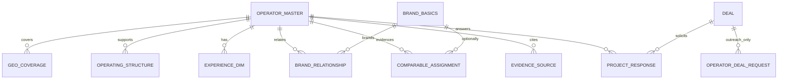

# Operator Fit — Airtable Enrichment Architecture

**Status:** Proposed (dry-run only — **do not apply**)  
**Date:** 2026-08-03  
**Related:** `docs/data/operator-fit-minimum-viable-operator-profile.md`, `docs/audits/operator-fit-current-state-airtable-audit.md`

---

## Verdict

**Retain** Operator Setup Master + child tables as the operator identity spine.  
**Extend** sparsely used structured fields already on Platform / Commercial / Governance.  
**Normalize** geography, experience, brand relationships, comparables, and evidence via **linked records** rather than stuffing more free-text onto Master.  
**Do not** use Operator Deal Requests as shortlist storage.

---

## Separation of concerns

| Domain | Purpose | MVP? |
| ------ | ------- | ---- |
| Operator master | Identity, status, governance meta | Yes — exists |
| Operator geographic coverage | Countries, regions, presence level | Yes — extend Platform + optional child |
| Operator operating structures | Supported structures + conditions | Yes — populate Commercial field |
| Operator experience | Asset / segment / development / complexity | Yes — Case Studies + structured flags |
| Brand–operator relationships | Approval, BM availability, regions, source, verified date | Yes for branded deals |
| Comparable operator assignments | Structured comps | Yes for Ranking Ready credibility |
| Evidence sources | URL, type, date, claim, class, verification | Yes |
| Project-specific operator responses | Outreach answers, fees, capacity | Later (Level E) |

---

## Existing tables to reuse

| Table | Reuse |
| ----- | ----- |
| Operator Setup - Master | Identity, Active status, confidence meta |
| Profile & Positioning | Chain scales, brands link, service models |
| Platform & Markets | Active Countries / Markets / Presence Type |
| Commercial Fit & Terms | Management Structures, conversion, openings |
| Governance, Delivery & Diligence | Reporting level; **not** primary ranking via Offered Services |
| Case Studies | Seed for comparables (extend fields carefully) |
| Brand Relationships (if present) | Extend for approval + BM confirmation |
| Partner Intelligence Source Library | Evidence spine where already governed |
| Brand Basics | Linked brand identity |

---

## New / extended objects (proposed)

| Object | Type | MVP essential? | Notes |
| ------ | ---- | -------------- | ----- |
| Operator Geographic Coverage | New linked table **or** disciplined Platform multi-selects | Essential (populate first) | Prefer populate existing fields before new table |
| Operator Experience Dimension | New linked **or** controlled Commercial multi-selects | Essential for differentiation | Avoid yes/no marketing sprawl |
| Brand–Operator Relationship | Extend / create linked | Essential for BM + approvals | Source + verified date required |
| Comparable Assignment | Extend Case Studies | Essential | Metadata + why comparable |
| Evidence Source | Linked evidence rows | Essential | Claim-level, not Master Source Type alone |
| Project-Specific Operator Response | New (later) | Wait | Level E outreach |

### Candidate new fields (founder approval required before create)

| Field | Table | Type | Purpose |
| ----- | ----- | ---- | ------- |
| Approval Status | Brand–Operator Relationship | select | Approved / Pending / Restricted |
| Approval Source | Brand–Operator Relationship | url/text | Evidence |
| Date Verified | Brand–Operator Relationship | date | Freshness |
| Direct Brand Management Available | Brand–Operator Relationship | checkbox/select | Founder 2.3 |
| Evidence Class | Evidence | select | Config enum |
| Claim Supported | Evidence | text/link | What assertion |
| Why Comparable | Comparable / Case Study | text | Ranking narrative |
| Support Level (geo) | Geo Coverage | select | Active / Pipeline / Target |

---

## Cardinality (conceptual)

---

## Controlled vocabularies

Reuse existing Platform/Commercial/SI option registries. Create options only via `ensure-*` scripts after founder approval. Never invent select options in application code.

---

## Ownership & cadence

| Domain | Owner | Update frequency |
| ------ | ----- | ---------------- |
| Normalized baseline | Dealality | Continuous research queue |
| Operator-reported intake | Operator (classified as reported) | On submission |
| Brand confirmations | Brand / Dealality | On verification events |
| Project responses | Outreach | Per deal |
| Evidence | Dealality PI / research | On claim publish |

---

## Migration risk & backward compatibility

| Risk | Mitigation |
| ---- | ---------- |
| Breaking Explorer readers | Additive fields only; dual-read adapters |
| Breaking OAS | Do not change OAS field reads in this phase |
| Taxonomy collisions | Dry-run taxonomy validation first |
| Prose markets mistaken for countries | Keep structured countries authoritative |
| ODR misuse as shortlist | Explicitly forbidden |

**MVP essential without schema create:** populate existing Active Countries, Management Structures, Case Study comps, and attach evidence sources using existing PI/Case Study surfaces where possible.  
**Can wait:** Level E response table, regional capacity graph, fee objects, shortlist persistence.

---

## Explicit non-apply statement

This document is architecture only. No Airtable schema mutation, backfill, or record write is authorized by this phase.
