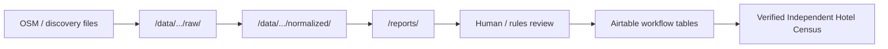

# Independent census raw data store plan

## Goal

Move raw OSM and future discovery imports **out of Airtable** into a durable local (later database) layer. Airtable holds **curated workflow state** only.

## Directory layout

```
/data/independent-census/
  raw/           # Immutable-ish imports (OSM extracts, Wikidata dumps, etc.)
  normalized/    # Parsed rows aligned to candidate schema (pre-Airtable)
/reports/        # Phase outputs: coverage, backwards-match, cleanup plans
```

Reports already produced under `reports/` remain the audit trail for dry-runs and human review.

## Data flow (target)



## What stays in Airtable

| Table | Role |
|-------|------|
| Independent Hotel Source Candidates | Curated leads only (not full OSM lake) |
| Independent Hotel Source Evidence | Applied evidence for promotion |
| Verified Independent Hotel Census | Human-approved census records |

## What moves out of Airtable

- Full-country OSM hotel dumps
- `low_priority_hold` rows without website, brand, evidence, or legacy high match
- Duplicate-heavy clusters after export and review

## Future OSM country runs

1. Write **reports first** (coverage, dedupe, retention) from normalized JSON.
2. Push only **curated subsets** to Airtable (`keep_high_priority`, `enrich_next`, `keep_for_matching`, evidence-backed, brand-directory overlaps).
3. Keep `low_priority_hold` in `/data/independent-census/raw/` unless promoted by backwards-match or enrichment.

## Backwards-match without candidate API reads

The global backwards-match script loads OSM fields from the Phase 4O retention JSON (`candidateRows`), not from the Candidates table API. That avoids additional read pressure and treats the report as the operational snapshot for matching.

Legacy Hotel Census is still loaded read-only from Airtable for benchmark matching (safe fields only).

## Archive / delete policy (future)

Any removal from Airtable requires:

1. **Export report** — CSV/JSON under `reports/` or copy to `/data/independent-census/raw/`
2. **Manual review** — Sign-off that evidence-linked and verified-linked IDs are excluded
3. **`--apply`** on a dedicated archive script (not implemented in recovery phase 1)
4. **Protections** — Hard block if record has Evidence links, Verified links, or `brand_directory` source

## SQLite / Postgres (later)

When record volume exceeds comfortable JSON handling:

- Index normalized candidates by `sourceRecordId`, country, retention, dedupe key
- Store backwards-match results as queryable tables
- Keep Airtable sync as a thin “workflow queue” layer

## Related

- [Airtable record limit recovery plan](./airtable-record-limit-recovery-plan.md)
