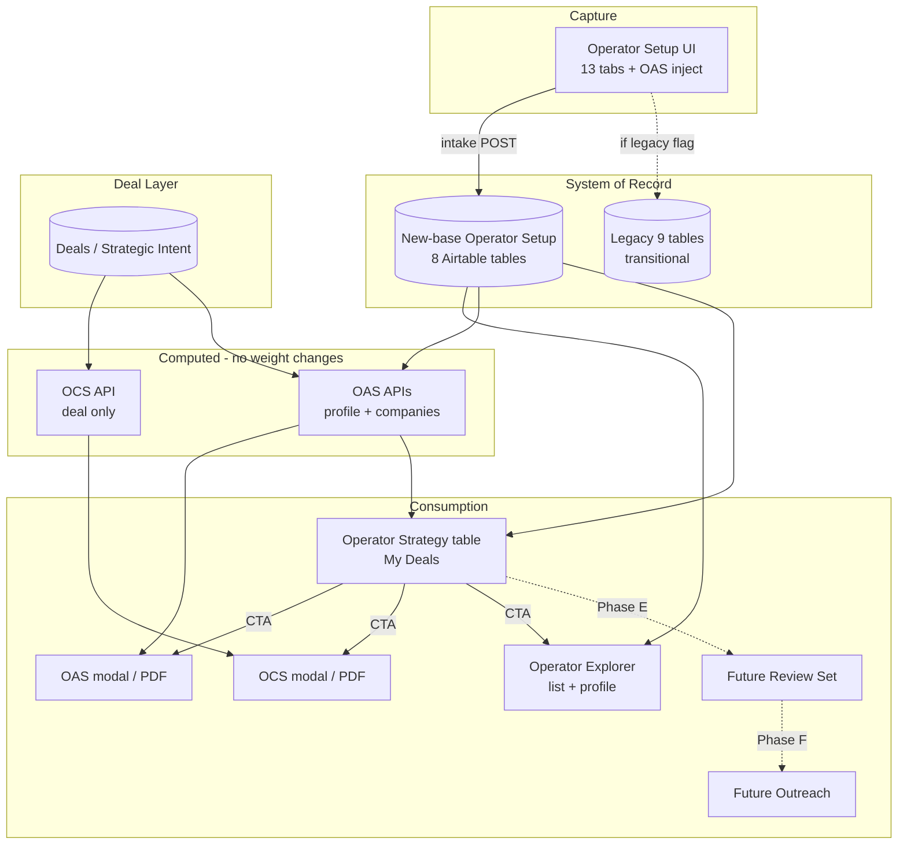

# Operator-Side System Comparison & Implementation Plan

**Status:** Planning document — no code, Airtable, scoring, or PDF layout changes implied by this file alone.  
**Date:** 2026-05-26  
**Audience:** Product, engineering, data/ops  

---

## 1. Executive Summary

Dealality’s operator side should be organized as a **single data spine** (Operator Setup on new-base Airtable tables) with **three consumption layers**:

1. **Capture** — 13-tab Operator Setup UI (`third-party-operator-setup-new-two.html`) writes operator master data, explorer narrative fields, child tables (leadership, case studies, diligence Q&A), and OAS alignment fields.
2. **Discovery** — Operator Explorer lists **Active** operators from the same new-base read path and opens **gold-mock** detail profiles keyed by Master `rec…` id.
3. **Deal workflow** — Per-deal artifacts stay separate and neutral:
   - **OCS** (Operator Capability Snapshot) = deal-only capability themes; no operator shortlist.
   - **OAS** (Operator Alignment Snapshot) = deal profile + operator profile pathways + **company-level** alignment from Operator Setup.
   - **Operator Strategy** (My Deals) = cross-deal **table-first** pipeline: one row per deal × operating company, Matched Brands–style filters and CTA icons—not a second deal workspace.

**Recommended architecture**

| Layer | System of record | Consumers |
|--------|------------------|-----------|
| Operator identity & footprint | **New-base Operator Setup** (8 tables) | Explorer, OAS companies API, Operator Strategy rows, future review set |
| Deal operator intent | **Deals** (Strategic Intent / OCS P0 fields) | OCS, OAS deal context, readiness |
| Deal × operator fit | **Computed** (OAS scoring engine; no weight changes in this plan) | OAS PDF/book, Operator Strategy table |
| Owner workflow state | **Future** Deal Operator Review Set + outreach | Operator Strategy CTAs (disabled until built) |

**Immediate product direction:** Finish aligning **Operator Strategy** with other My Deals tabs (one table, no deal selector, no summary cards). In parallel, close the **field-coverage gap** between the 417-form-field intake UI and the **103-row** new-base writer build sheet so Explorer, OAS, and Strategy read the same populated columns.

**Legacy 9-table writer** remains on by default (`OPERATOR_SETUP_USE_NEW_BASE_WRITER=0` in `.env.example`). Treat legacy as **technical debt** to retire after Phase B mapping—not as a second product truth.

---

## 2. Component Comparison

### 2.1 Operator Setup UI

| | |
|--|--|
| **Purpose** | Operator self-serve / admin intake: company profile, explorer tabs, deal terms, proof, diligence. |
| **Current source of data** | Empty form + prefill from `GET /api/intake/third-party-operators/:id` (new-base read) or legacy prefill builders. |
| **Current output** | `POST` intake → legacy write plan **or** `writeOperatorSetupToNewBase()` when env flag set; payloads include `caseStudiesDetail`, `ownerDiligenceQa`, `brandsPortfolioDetail`, `explorerProfileJson`, `exec_*` repeaters. |
| **Current risks** | ~417 static form fields vs **103** new-base mapped fields → many inputs may not persist to new-base tables. OAS fields injected in JS (`oas-inject-form-fields.js`) are easy to miss in audits. `regions` and hidden JSON fields do not map 1:1 to new-base columns. |
| **Recommended role** | **Primary capture UI** for all operator-side data. Single 13-tab surface; no parallel “old” setup form for production. |

**Key files:** `public/third-party-operator-setup-new-two.html`, `public/js/operator-setup-explorer-behavior.js`, `public/js/oas-inject-form-fields.js`, `scripts/he-cala-form-inventory.json` (417 fields).

---

### 2.2 Operator Setup Airtables (new-base)

| | |
|--|--|
| **Purpose** | Normalized operator CRM: Master + 4 one-to-one tables + 3 child tables. |
| **Current source of data** | Intake writer, scripts (`apply-he-cala-inventory-to-airtable.mjs`), manual Airtable edits. |
| **Current output** | Read via `api/lib/operator-setup-new-base-read.js`; list row shape via `buildNewBaseListRow`. |
| **Current risks** | Schema backup (`reports/operator-alignment-5b-schema-backup-2026-05-25.json`) may be ahead of writer coverage. Granular governance service columns exist but UI uses aggregate multis. `dealTermsOptIn`, `diligenceQaOptIn` in schema with **no** form control. |
| **Recommended role** | **System of record** for operator profiles, footprint, services, leadership children, case studies, diligence Q&A, and OAS field columns on Platform/Profile/Master. |

**Tables**

- `Operator Setup - Master`
- `Operator Setup - Profile & Positioning`
- `Operator Setup - Platform & Markets`
- `Operator Setup - Commercial Fit & Terms`
- `Operator Setup - Governance, Delivery & Diligence`
- `Operator Setup - Leadership Team Members` (child)
- `Operator Setup - Case Studies` (child)
- `Operator Setup - Diligence QA` (child)

---

### 2.3 Operator Setup new-base writer

| | |
|--|--|
| **Purpose** | Map form `name=` values → new-base column names on save. |
| **Current source of data** | `api/lib/operator-setup-new-base-build-sheet-rows.json` (**117** rows after Phase B) + Master admin fields in `createOrUpdateOperatorMaster` + granular service expansion + child payloads. |
| **Current output** | Creates/updates Master + linked rows when `OPERATOR_SETUP_USE_NEW_BASE_WRITER=1`. |
| **Current risks** | **~75%** of static form fields (by count) are not in the build sheet. Company Profile geo grid, most Owner Value scalars, many deal-term fields may only reach **legacy** tables today. |
| **Recommended role** | **Only** write path for Operator Setup once mapping CSV/sheet is complete; legacy writer becomes read-only fallback then removed. |

**Key files:** `api/lib/operator-setup-new-base-writer.js`, `api/third-party-operator-intake.js`, `scripts/generate-operator-setup-build-sheet-rows.mjs`, `api/lib/operator-setup-new-base-phase-b-fields.json`, `docs/operator-setup-new-base-writer-extension-phase-b.md`.

**Phase B (2026-05-25):** P0 OAS/Explorer/Strategy fields mapped — Master admin (`Data Confidence Level`, `Source Type`, `Last Updated Date`), Profile identity, Platform footprint (`chainScale`, `totalProperties`, `regions`→`specificMarkets`). OAS-needed unmapped count **0**. `OPERATOR_SETUP_USE_NEW_BASE_WRITER` still **0** in production; safe for **staging** test. See Phase B doc.

---

### 2.4 Operator Setup legacy writer

| | |
|--|--|
| **Purpose** | Route form fields to legacy 9 tables (`3rd Party Operator - Basics`, Footprint, Performance, Services, Ideal Projects, Owner Relations, Deal Terms, Case Studies, Diligence QA). |
| **Current source of data** | `api/lib/operator-setup-write-plan.js`, `api/lib/third-party-operator-airtable-fields-used.js`, `third-party-operator-new-two-field-bindings.json`. |
| **Current output** | Default intake persistence (`OPERATOR_SETUP_USE_NEW_BASE_WRITER=0`). |
| **Current risks** | Dual truth if new-base and legacy diverge. Explorer list API already reads **new-base**; legacy-only fields may be invisible to OAS/Explorer. |
| **Recommended role** | **Transitional** only. Freeze new legacy field additions; migrate readers/writers to new-base, then deprecate. |

---

### 2.5 Operator Explorer

| | |
|--|--|
| **Purpose** | Directory of **Active** third-party operators for owner/advisor discovery. |
| **Current source of data** | `GET /api/third-party-operators?activeOnly=1` (new-base Master + Profile + Platform + children metadata). Detail: `GET /api/intake/third-party-operators/:id` + `operator-explorer-gold-mock.html`. |
| **Current output** | Card list + modal profile (gold-mock UI). **Not** `operator-explorer-detail.html` (legacy brand-library-style shell). |
| **Current risks** | Profile modal showed demo placeholder (“Altura”) until loading state fix; depends on new-base field population. List filters may not expose all OAS columns until mapped. |
| **Recommended role** | **Read-only discovery** on new-base fields; same `rec…` ids as Operator Strategy “Open Operator Profile”. |

**Key files:** `public/operator-explorer.html`, `public/js/operator-explorer.js`, `public/operator-explorer-gold-mock.html`, `public/js/operator-explorer-gold-mock-data.js`, `api/third-party-operators-list.js`.

---

### 2.6 Operator Capability Snapshot (OCS)

| | |
|--|--|
| **Purpose** | Deal-only operating capability themes for owner/advisor review (**not** operator matching). |
| **Current source of data** | `GET /api/deals/:dealId/operator-capability-snapshot` — deal Strategic Intent + OCS P0 fields (`lib/operator-capability-inputs.js`). |
| **Current output** | 2-page book (`operator-capability-snapshot.js`); My Deals modal on **Operator Strategy** tab only (removed from Deal Info). |
| **Current risks** | Conflated with OAS in copy/CTAs if placed on wrong tab. Unrelated to Operator Setup company rows. |
| **Recommended role** | **Deal artifact** — open from Operator Strategy (and optionally Deal Info later if product reverses). No PDF/layout changes in this plan. |

---

### 2.7 Operator Alignment Snapshot (OAS)

| | |
|--|--|
| **Purpose** | Profile-level pathways + **company-level** alignment for a deal; neutral screening language. |
| **Current source of data** | `GET /api/operator-alignment-snapshot/:dealId/profile` + `/companies`; deal fields + `lib/operator-alignment-company-utils.js` (Active Operator Setup masters). |
| **Current output** | Full book in modal (`OperatorAlignmentSnapshot.render` embed); standalone HTML route still exists. |
| **Current risks** | Scoring/weights are sensitive—out of scope to change. Company list quality depends on Operator Setup completeness + `dataConfidenceLevel`. |
| **Recommended role** | **Deal × operator fit document**; company list feeds **Operator Strategy** table via `/companies` flatten. |

---

### 2.8 Operator Strategy tab (My Deals)

| | |
|--|--|
| **Purpose** | Cross-deal working list: operating companies under consideration (deal × company rows). |
| **Current source of data** | Client fan-out: `allDeals` × `GET /api/operator-alignment-snapshot/:dealId/companies` (max 40 deals, concurrency 4). |
| **Current output** | Table + filters + CTAs (OAS/OCS modals, Explorer profile iframe). |
| **Current risks** | N+1 API pattern; partial load banner. UX drift vs Matched Brands if deal-scoped chrome returns. Column set differs slightly from original spec (see §6). |
| **Recommended role** | **Primary operator pipeline UI** in My Deals—table-first, no deal selector. |

**Key files:** `public/js/operator-strategy-my-deals.js`, `public/css/operator-strategy-my-deals.css`, `docs/operator-strategy-my-deals-tab.md`.

---

### 2.9 Future: Deal Operator Review Set

| | |
|--|--|
| **Purpose** | Persist owner’s shortlist of operators per deal (analogous to brand target list)—enables “Add to Operator Review” and outreach. |
| **Current source of data** | **Not implemented** — documented in OAS phase-4 as missing. |
| **Current output** | CTA disabled / in ⋯ menu only. |
| **Current risks** | Without storage, Strategy tab is read-only for workflow actions. |
| **Recommended role** | **Workflow state layer** on top of OAS scores; written from Strategy CTAs in Phase E. |

---

## 3. Data Flow Map



**Narrative flow (target state)**

1. Operator completes **Operator Setup UI** → persisted to **new-base** tables (all material fields, including OAS columns and children).
2. **Operator Explorer** reads the same Master ids (`rec…`) for discovery and profile modal.
3. Owner completes deal Strategic Intent → **OCS** (deal) and **OAS** (deal + companies) use deal + operator data.
4. **Operator Strategy** flattens `companiesForConsideration` across deals into one table; CTAs open OAS/OCS/Explorer without leaving My Deals.
5. **Deal Operator Review Set** stores chosen operators per deal → enables review + outreach CTAs.
6. **Outreach/proposal** reuses deal-room patterns (future).

---

## 4. Source of Truth Recommendation

### Recommendation: **Yes — new-base Operator Setup should become the sole write and read source**

| Data | New-base | Legacy-only (today) | Action |
|------|----------|---------------------|--------|
| Master identity, submission_status | ✓ | Partial overlap on Basics | Migrate; stop dual-write |
| Explorer narrative (`overview_*`, `cap_*`, `brand_*`, …) | ✓ | Explorer Profile JSON on Basics | Prefer columns + JSON mirror if needed |
| Footprint geo grid (`geo_*`), chain scale counts | ✓ | Footprint table titles | Extend build sheet |
| OAS operator fields (active markets, service models, …) | ✓ (columns + bindings) | Some titles only on legacy | Ensure writer + list API expose same keys |
| Owner value / deal terms / company profile prose | Schema ✓ | Often legacy-only write | **Phase B** mapping priority |
| Leadership / case studies / diligence | Child tables ✓ | Legacy child tables | Already on new-base path |
| `dataConfidenceLevel`, `sourceType`, `lastUpdatedDate` | Master/Platform bindings | — | Keep on Setup + show in Strategy |

**Remain legacy-only (until migrated)**

- Human-readable field titles in `third-party-operator-airtable-fields-used.js` not yet mapped to new-base columns.
- Any intake field with **no** row in build sheet and **no** child/json path (see §5).
- `regions` form field → should map to `specificMarkets` / `geo_*`, not a phantom `regions` column.

**Migration approach**

1. Generate **field coverage diff** (form ∩ schema ∩ build sheet ∩ bindings).
2. Extend `operator-setup-new-base-build-sheet-rows.json` (or grouped CSV) until coverage ≥ agreed threshold (e.g. 95% of fields used by OAS/Explorer).
3. Turn on `OPERATOR_SETUP_USE_NEW_BASE_WRITER=1` in staging; run backfill script for existing operators.
4. Remove legacy writer paths after parity tests.

**Read path today:** `third-party-operators-list.js` and OAS company utils already use **new-base** — legacy-only writes create **silent gaps** for Explorer and Strategy.

---

## 5. Field Coverage Risk Summary

### Sources audited

| Artifact | Role | Scale |
|----------|------|-------|
| `public/third-party-operator-setup-new-two.html` + `scripts/he-cala-form-inventory.json` | Form `name=` inventory | **417** static fields |
| `public/js/oas-inject-form-fields.js` | Markets-tab OAS/admin fields (dynamic) | ~20 fields |
| `reports/operator-alignment-5b-schema-backup-2026-05-25.json` | Airtable column catalog | 8 tables |
| `api/lib/operator-setup-new-base-build-sheet-rows.json` | New-base writer map | **103** rows |
| `api/lib/third-party-operator-airtable-fields-used.js` | Legacy write registry | 9 tables, 100s of titles |
| `api/lib/operator-setup-write-plan.js` | Legacy routing | Per-section plans |

### Fields needed by OAS (operator side)

Deal fields (Deals table) are out of scope here; **operator** inputs for alignment include:

- Operator Setup **Master:** `submission_status` (Active gate), `dataConfidenceLevel`, `sourceType`, `lastUpdatedDate`
- **Platform / Profile:** regions/markets, chain scale, service models, management structures, offered services, pre-opening, conversion/reflag, soft brand, F&B, revenue management, sales platform, owner reporting, governance cadence, minimum keys, brand signals, footprint counts
- **Commercial / Governance:** `bf_*` best-fit, operating situations, asset types
- **Child data:** case studies, diligence Q&A (narrative context)

Many are in **bindings** and **OAS inject**; not all are in the **103-row** build sheet.

### Fields needed by Operator Explorer

- List: `companyName`, logo, regions, chain scale, brands, service model, property/room counts, `submission_status=Active`
- Detail (gold-mock): same new-base read bundle as intake prefill — `overview_*`, `cap_*`, leadership children, footprint tables, services, proof, diligence

**Risk:** List API uses new-base; if intake only writes legacy, Explorer cards look empty or stale.

### Fields needed by Operator Strategy table

Per row (from `/companies` API):

| Column | Typical source |
|--------|----------------|
| Project / Deal | My Deals deal record |
| Operating Company | `companyName` + parent |
| Project Location | Deal `hotelLocation` (current UI) |
| Alignment Signal (optional product column) | `alignmentBand` / band label (filter uses this today) |
| Score | `alignmentScoreOptional` |
| Review Status / Key Consideration | OAS narrative fields |
| Data Confidence | `dataConfidenceLevel` on operator master |
| Operator id for profile CTA | `operatorId` (`rec…`) |

### Fields still legacy-only (representative)

- Large portions of **Company Profile** text fields (history, mission, ESG blocks) if not in build sheet
- **Owner Value & Engagement** scalars (`ownerRetention`, reporting cadence, etc.) — many bound to legacy “Owner Relations” titles
- **Deal Terms** block — extensive `minInitialTerm*`, fee, termination fields; schema on Commercial table but incomplete writer map
- **`regions`** as a form name — legacy Footprint, not new-base column name

### Fields not mapped to new-base writer

- Any of the **~314** form inventory fields not listed in `operator-setup-new-base-build-sheet-rows.json` and not covered by granular-service or child writers
- **Granular** governance checkboxes (dozens) — derived from aggregate multis at write time, not separate form fields

### Fields with no UI control (schema only)

| Field | Table |
|-------|--------|
| `dealTermsOptIn` | Commercial Fit & Terms |
| `diligenceQaOptIn` | Governance |
| `operator_id`, `created_at`, `updated_at` | Master (system) |

### Payload paths without static `name=` (still “used”)

| Payload key | Target |
|-------------|--------|
| `caseStudiesDetail` | Case Studies child |
| `ownerDiligenceQa` | Diligence QA child |
| `brandsPortfolioDetail` | Platform JSON column |
| `explorerProfileJson` | Legacy Basics + optional mirror |
| `companyLogo` | Profile attachment |

---

## 6. Operator Strategy UX Recommendation

### Target: table-first My Deals tab (aligned with Matched Brands / Contacted)

**Remove (do not restore)**

- Primary deal selector dropdown
- “Switch deal” control
- “Deal Actions” block above the grid
- “Operating Pathways to Validate” (stays inside OAS/OCS content)
- Per-deal summary cards / KPI tiles at top of tab

**Keep**

- Single table: **Operating Companies for Consideration**
- **Project / Deal** column (name link → deal brief/view)
- **Operating Company** (+ optional parent)
- **Score** (badge; not ranked; no “recommended” language)
- **Review Status**, **Key Consideration**, **Data Confidence**
- **Call to Action** icon column (single row, no wrap)
- Filters: Search, View (alignment band + review states), Reset View, optional deal filter chip via deep link only

### Column note: Alignment Signal vs Project Location

| Item | Recommendation |
|------|----------------|
| **Alignment Signal** | Product spec column: band chip (Strong / Moderate / Conditional / Limited / Insufficient). **View** filter already uses bands server-side. |
| **Project Location** | Implemented today as visible column (deal geography). Useful for cross-deal scanning. |
| **Decision** | Either (a) show **both** Location + Alignment Signal, or (b) keep Location in table and band only in View filter + OAS modal. Document choice in Phase C UX sign-off. |

**Current build (May 2026):** Project Location column present; Alignment Signal column removed from table; band still drives View filter.

---

## 7. CTA Column Recommendation

| Order | Icon | Label | Action | Availability |
|-------|------|-------|--------|----------------|
| 1 | Clipboard | View Operator Alignment Snapshot | `openMyDealsOperatorAlignmentForDeal(dealId)` — readiness modal, full OAS book `embed: true` | **Live** |
| 2 | Sun/capability | View Operator Capability Snapshot | `openMyDealsOperatorCapabilityForDeal(dealId)` — readiness modal, OCS `embed: true` | **Live** (Operator Strategy only) |
| 3 | User | Open Operator Profile | `openMyDealsOperatorProfileForDeal(operatorId)` → `/operator-explorer-gold-mock.html?id=rec…&embed=1` | **Live** when `rec…` id |
| 4 | Bookmark | Add to Operator Review | Future: write Deal Operator Review Set | **Disabled** — in ⋯ menu until Phase E |
| 5 | Mail | Prepare Outreach | Future: outreach workflow | **Disabled** — in ⋯ menu until Phase F |

**UX parity**

- Same readiness overlay pattern as Deal Readiness / Brand Alignment (title, subtitle, ×, dimmed backdrop)—not full-page iframe navigation.
- Expose `window.openMyDealsOperatorAlignmentForDeal` and `window.openMyDealsOperatorCapabilityForDeal` (fixed for Operator Strategy).
- **Deal Info** tab: no OCS/OAS icons (product decision May 2026)—operator artifacts live on Operator Strategy only.

---

## 8. Operator Explorer Recommendation

Explorer list and profile should read the **same normalized fields** intended for OAS and Strategy, surfaced consistently:

| Field group | Form / binding names | Use in Explorer |
|-------------|----------------------|-----------------|
| Active markets | `activeCountries`, `activeMarkets`, `regionsSupported`, `geo_*` | Filters, card meta, footprint tab |
| Market presence type | `marketPresenceType` | Card badge, Markets tab |
| Service models | `serviceModelsSupported`, `primaryServiceModel` | Card + Platform tab |
| Chain scales | `chainScalesSupported`, `chainScale` | Stripe color, filters |
| Management structures | `managementStructuresSupported` | Best fit / Platform |
| Offered services | `offeredServices`, service multis | Infrastructure tab |
| Pre-opening capability | `newBuildOpeningExperience`, `preOpeningSupportCapability`, `preOpeningExperience` | Best fit, signals |
| Owner reporting level | `ownerReportingLevel` | Owner engagement tab |
| Revenue management capability | `revenueManagementCapability` | Platform / Infrastructure |
| Data confidence | `dataConfidenceLevel` | Admin badge; pass-through to Strategy column |

**Implementation rules**

1. **Single read module** — `operator-setup-new-base-read.js` (+ detail intake handler) is the only list/detail source; deprecate `operator-explorer-detail.html` for product flows.
2. **No mock fallback** for Active `rec…` ids in production (gold-mock demo only when load fails and no id).
3. **Filter parity** — Explorer filters should use the same option sets as OAS inject (`fixtures/operator-alignment-field-options.json`).
4. **Id parity** — `operatorId` in Strategy must equal Explorer list `id` (Master record id).

---

## 9. Phased Implementation Plan

### Phase A — Field coverage diff (no Airtable schema changes)

**Goal:** Authoritative matrix: form field → new-base column → legacy title → OAS/Explorer/Strategy consumer.

**Deliverables**

- `docs/operator-setup-field-coverage-diff.csv` (or `.md` tables)
- Script: extend `scripts/export-he-cala-form-inventory.mjs` to merge OAS inject + child payloads + build sheet + bindings
- Gap report: unmapped form fields, schema-only columns, legacy-only titles

**Exit criteria:** Signed priority list (P0 = blocks OAS/Explorer/Strategy).

---

### Phase B — Targeted new-base writer extension

**Goal:** Persist P0 fields to new-base; enable `OPERATOR_SETUP_USE_NEW_BASE_WRITER=1` in staging.

**Deliverables**

- Updated `operator-setup-new-base-build-sheet-rows.json` / CSV grouped by table
- Backfill script for existing Active operators (optional inventory CSV path)
- Parity test: save HE/CALA sample → read list API → OAS companies → Explorer profile

**Exit criteria:** Explorer + OAS companies show non-empty for P0 fields on test operators.

**Out of scope:** Scoring weight changes; new Airtable tables.

---

### Phase C — Operator Strategy table-first refactor (done 2026-05-25)

**Goal:** My Deals-native cross-deal table (no deal selector workspace).

**Delivered**

- Header + subcopy; **Operating Companies for Consideration** table
- Columns: Project/Deal (with location subline), Operating Company, **Alignment Signal** chips, Score, Review Status, Key Consideration, Data Confidence, CTA
- Filters: search, alignment signal, project/deal dropdown, refresh
- Deep link `dealId` → filter chip (not selector)
- Five CTA icons (OAS, OCS, Profile active; Review/Outreach disabled)
- `node scripts/validate-operator-strategy-my-deals-tab.mjs`
- `docs/operator-strategy-my-deals-tab.md`

**Out of scope:** Scoring, BAS, OCS, OAS PDF, Airtable schema, Review Set table.

---

### Phase D — Operator Explorer integration

**Goal:** Explorer fully on new-base fields; filters match OAS.

**Deliverables**

- List card fields from same DTO as Strategy
- Profile modal loading states (no placeholder operator flash)
- Deprecate product links to `operator-explorer-detail.html`

**Exit criteria:** List + profile reflect saved Setup data after Phase B backfill.

---

### Phase E — Deal Operator Review Set

**Goal:** Persist per-deal operator shortlist; enable “Add to Operator Review” CTA.

**Deliverables**

- Airtable schema design (product-approved — **not** in this doc’s scope to create)
- API: add/remove/list by dealId
- Strategy CTA wired; row badge “In review set”

**Exit criteria:** Owner can build review list from Strategy table.

---

### Phase F — Operator outreach / proposal workflow

**Goal:** “Prepare Outreach” CTA; integrate with deal room / outreach plans.

**Deliverables**

- Workflow spec (neutral copy)
- CTA enablement from review set
- Activity logging (optional)

**Exit criteria:** End-to-end demo on one deal.

---

### Recommended implementation sequence

```
A (diff) → B (writer) → D (Explorer) in parallel with C (Strategy UX)
         → E (review set) → F (outreach)
```

**Do not start E/F until B completes** — review set rows need stable `operatorId` and confidence fields.

---

## 10. Recommended Next Implementation Prompt

Copy into Cursor when ready to execute (still **no** scoring/PDF/Airtable schema changes unless Phase E explicitly approved).

### Prompt A — Phase A field coverage diff

```
Phase A only: Operator Setup field coverage diff. Do not change production runtime behavior, scoring, or PDF layouts.

1. Run or extend scripts/export-he-cala-form-inventory.mjs to include:
   - static fields from third-party-operator-setup-new-two.html
   - fields from public/js/oas-inject-form-fields.js
   - child/json payloads: caseStudiesDetail, ownerDiligenceQa, brandsPortfolioDetail, explorerProfileJson, exec_*
2. Cross-reference:
   - reports/operator-alignment-5b-schema-backup-2026-05-25.json (new-base columns by table)
   - api/lib/operator-setup-new-base-build-sheet-rows.json
   - api/lib/third-party-operator-new-two-field-bindings.json
   - api/lib/third-party-operator-airtable-fields-used.js (legacy titles)
3. Produce docs/operator-setup-field-coverage-diff.md with tables:
   - P0 for OAS, Explorer list, Explorer detail, Operator Strategy
   - form-only (no schema), schema-only (no UI), legacy-only, new-base-writer-mapped
4. Summarize counts and top 20 gaps blocking OPERATOR_SETUP_USE_NEW_BASE_WRITER=1.

No Airtable schema edits. No writer code changes in this phase unless a tiny export script is needed.
```

### Prompt C — Phase C Operator Strategy table-first hardening

```
Phase C: Operator Strategy My Deals UX hardening only.

Constraints:
- Do not change OAS/OCS scoring or PDF/book layouts
- Do not change Airtable schema
- Keep OCS/OAS off Deal Info tab
- Neutral language only

Tasks:
1. Read docs/operator-side-system-comparison.md §6–§7 and docs/operator-strategy-my-deals-tab.md
2. Product column decision: implement Alignment Signal column (band chip) OR document why Project Location stays; align View filter labels
3. Ensure table-first chrome removed (deal selector, switch deal, deal actions, pathways block, summary cards) — validation script must pass
4. CTA row: OAS, OCS, Profile, More (disabled review + outreach in menu); readiness modals only
5. Optional: spike GET /api/operator-strategy/rows if fan-out >40 deals is a problem — propose only, implement only if trivial
6. Update docs/operator-strategy-my-deals-tab.md

Run: node scripts/validate-operator-strategy-my-deals-tab.mjs
```

---

## Risks & Open Decisions

| # | Risk / decision | Owner | Notes |
|---|-----------------|-------|-------|
| 1 | **Dual write** (legacy default vs new-base) | Engineering | Silent data loss for Explorer/OAS until B completes |
| 2 | **Alignment Signal vs Project Location** column | Product | Table filter already uses band |
| 3 | **N+1 companies API** on Strategy load | Engineering | Aggregate endpoint vs 40-deal cap |
| 4 | **Deal Operator Review Set** schema | Product + data | Blocks Phase E |
| 5 | **OCS on Deal Info** | Product | Currently Strategy-only |
| 6 | **Granular service columns** | Data | Keep writer-derived vs form per-checkbox |
| 7 | **OPERATOR_SETUP_USE_NEW_BASE_WRITER** rollout | Ops | Staging flag + backfill |
| 8 | **Mock/demo operators** in gold-mock | Engineering | Must not show for live `rec…` ids |

---

## Related documentation

- `docs/operator-strategy-my-deals-tab.md` — current tab behavior
- `docs/operator-alignment-snapshot-audit.md` — OAS vs OCS vs Explorer history
- `docs/operator-alignment-field-matrix.md` — deal/operator field requirements
- `docs/operator-alignment-snapshot-phase-4.md` — review set placeholder
- `reports/operator-alignment-5b-schema-backup-2026-05-25.json` — schema catalog

---

*End of document.*
